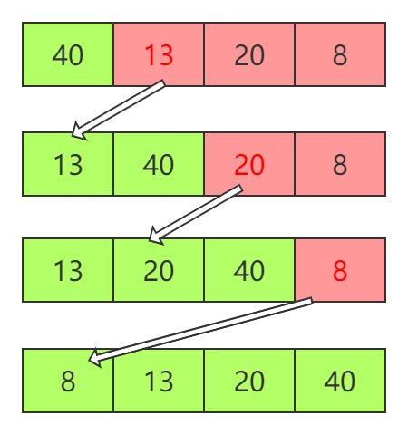

## 排序算法

### 选择排序

#### 思想

红色底色的块代表着当前进行遍历的list。红色字体的数字为当前list中的最大项，蓝色字体的数字为当前list中最大项应该在的位置。
#### code
```python
def selectionSort(array):
    n = len(array)
    for i in range(n-1,0,-1):
        maxIdx = i
        for j in range(0,i):
            if array[j] > array[maxIdx]:
                maxIdx = j
        swapElement(array,maxIdx,i)

def swapElement(array,x,y):
    temp = array[x]
    array[x] = array[y]
    array[y] = temp
```

### 插入排序

#### 思想

#### code
```python
def insertionSort(array):
    n = len(array)

    for i in range(1,n):
        next_ = array[i]
        j = i-1

        while j>=0 and array[j]>next_:
            array[j+1] = array[j]
            j=j-1
        array[j+1]=next_
```

### 冒泡排序

#### code
```python
def bubbleSort(array):
    n = len(array)

    for i in range(n-1,0,-1):
        for j in range(1,i+1):
            if array[j-1]>array[j]:
                swapElement(array,j,j-1)
```
#### Better Version
```python
def bubbleSort(array):
    n = len(array)

    for i in range(n-1,0,-1):
        isSorted = True


        for j in range(1,i+1):
            if array[j-1]>array[j]:
                swapElement(array,j,j-1)
                isSorted = False
        
        if isSorted:
            return
```
对于原版的冒泡排序算法，时间复杂度一直都是O(n^2^)。

Better Version这一版，最坏的情况下的时间复杂度是O(n^2^)，最好的情况下时间复杂度为O(n)。

### 归并排序

#### 思想

#### code
```python
def mergeSort(array,low,high):
    if low<high:
        mid = (low+high)//2

        mergeSort(array,low,mid)
        mergeSort(array,mid+1,high)

        merge(array,low,mid,high)

def merge(array,low,mid,high):
    n = high-low+1
    result = []
    left = low
    right = mid+1

    while left<=mid and right <=high:
        if array[left] <=array[right]:
            result.append(array[left])
            left+=1
        else:
            result.append(array[right])
            right+=1
    while left <= mid:
        result.append(array[left])
        left+=1

    while right<=high:
        result.append(array[right])
        right+=1
    for k in range(0,n):
        array[low+k] = result[k]

def mergeSortHelper(array):
    mergeSort(array,0,len(array)-1)
```