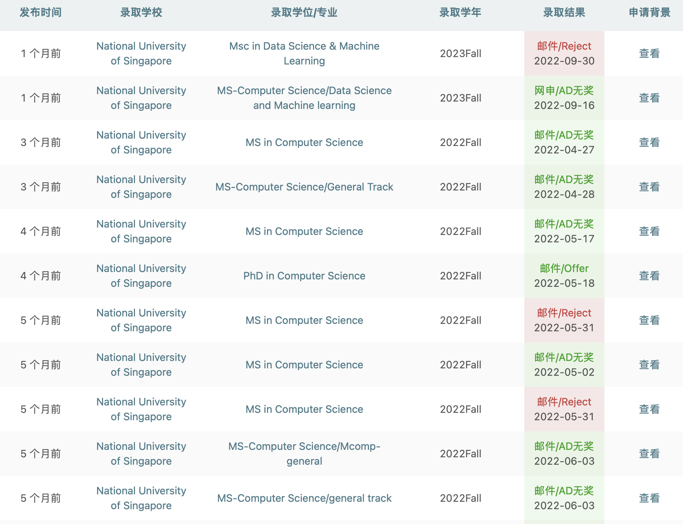
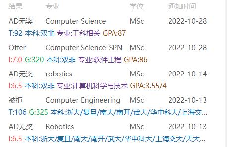
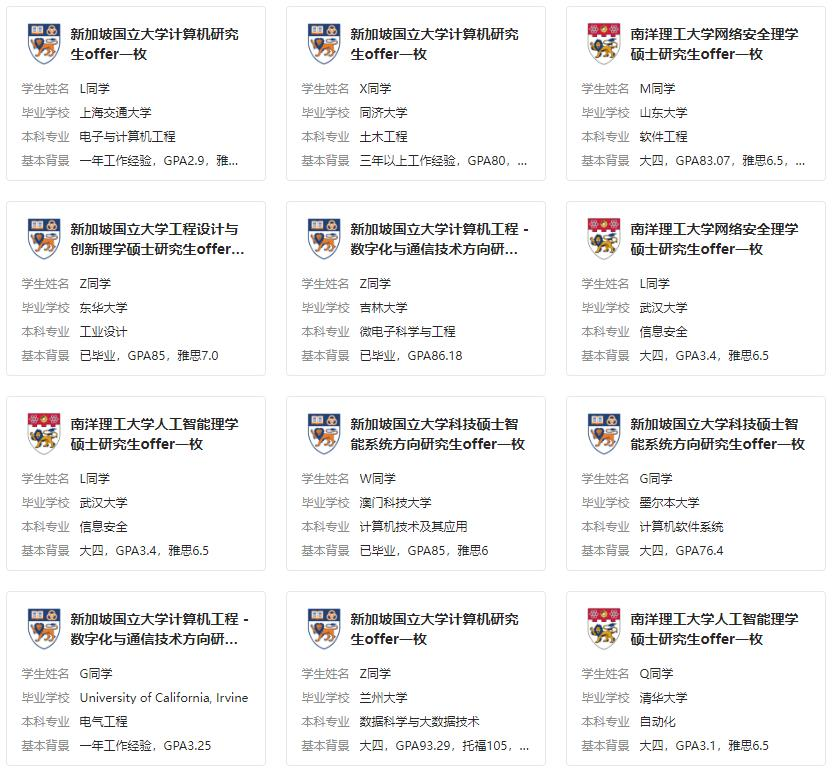

# 新加坡国立大学计算机系好申请吗？

## 问题描述

有没有人知道新加坡国立大学的school of computing申请难度怎么样，花费怎么样（其实有点想申研究型，虽然知道没什么希望）。本人985，211院校专业软件工程，GPA3.4-3.5之间，有阿里巴巴的实习经历，还获得过一些其他的奖项。希望能够有在国立多CS方面的人给一下意见，非常感谢。

## 情况分析

其实只是单纯的看985、211来判断的话，可能还是不够准确的。NUS CS这边对国内的大学其实是有一个明确list的，然后list上面的大学要划分rank。举个简单的例子，同样都是985行列的，华五和清北都是T0级别的，然后一众985都是T1级别的院校，但是也有一些可能文商科更厉害的985（譬如厦大）在CS这边是属于T2级别的。然后一些厉害的211也是T1级别的，譬如北邮、西电这种。所以如果信息更准确的话，可能得到的结果也是更准确的。如果有想申请NUS CS的学弟是来自双非的话，那么也不用太丧气，有一些行业知名度很高的双非也还是rank很高的，譬如重邮、杭电这种都是属于T2级别的院校。然后这个list也是会不断变化的。

其次，专业也会影响你的录取结果，学院这边对各个专业如何判断相关度也是有一定的文件，但是软件工程肯定是CS相关的，所以这一点不用担心。

GPA的话，肯定是越高越好的。3.4 - 3.5这个水平的话，其实单纯看GPA可能是有点不太美好，但是因为不同学校的算法其实是不一样的，如果你们学校就是GPA给的低一点，但是均分给的还不错的话，那么机会也还是很大的。而且很多时候是本校竞争的问题，如果你们学校有一样申请CS的，他们GPA比你高的话，那么你就还是存在着一个比较大的劣势。

有相关的实习经历是一个很加分的点，这边其实看重的就两点，一个是你的学术背景，另一个就是你的工作经历，实习经历勉强可以算作是工作经历。如果有两年以上的工作经历的话，那么就可以大幅度削弱学术背景上面的劣势。学院这边也是很偏好有丰富工作经历的同学。

作为一个“过来人”，我也有过你目前的这种想知道自己能申请到什么水平院校的好奇心，主要的参考对象就是往年的一些录取情况，通过参考往年的学长学姐们的具体背景来评估自己录取的可能性。但是这个仅供参考，因为具体你会不会被录取，这是要看你的竞争对手是一个什么样子的水平。

具体的一些录取情况你可以在三个地方找一找：

一是一亩三分地：

二是寄托天下：

三就是指南者留学app：

目前来说这三者是录取信息比较多的地方，而且这些地方的信息相对来说更完整一些。

我觉得你最应该考虑的问题是，你想具体读什么专业。因为GPA本身并不是十分突出，然后NUS SoC这边只能申请两个track，所以保险起见建议申请一个CS track和IS track。 CS track肯定是比较卷的，申请这个track是为了冲一下，IS track相对来说没有那么卷，所以申请这个track稳一稳。

CS track和IS track的区别就是IS track需要上一些IS track的必修课，所以需要花费一些时间在IS代码的课上。如果你的目的是就业的话，上IS的课不是坏事，因为有一些IS的课是偏向商科的，相对来说能节省很多需要花费在做作业和做project上面的时间，为你节省出时间去做你所真正需要做的事情。

## 花费

花费具体可以参考我的这个回答：

去新加坡留读研一年大概需要多少人民币？ - 萌小奇的回答 - 知乎
https://www.zhihu.com/question/511302666/answer/2349547285