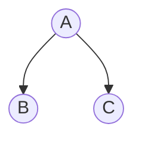

## 二叉树的最大路径和


#### 这道题虽然是困难，但是思路不难。
先上代码：
```python
class Solution:
    def maxPathSum(self, root: TreeNode) -> int:
        self.maxnum = float('-inf')

        def dfs(node):
            if not node:
                return 0
            

            left = dfs(node.left)
            right = dfs(node.right)

            self.maxnum = max(self.maxnum,node.val+left+right)
            return max(0,max(left,right)+node.val)
        dfs(root)
        return self.maxnum
```
情况总共有三种，假设一颗树为：

 第一种情况为，最大路径和是a+b+c
 第二种情况为，最大路径和是b+a+a的父节点
 第三种情况为，最大路径和是c+a+a的父节点
第二三种情况好解决，return max(0,a+max(b,c))即可。但是为了解决第一种情况，就得设置一个全局变量，来记录最大值。这就是self.maxnum存在的意义。
